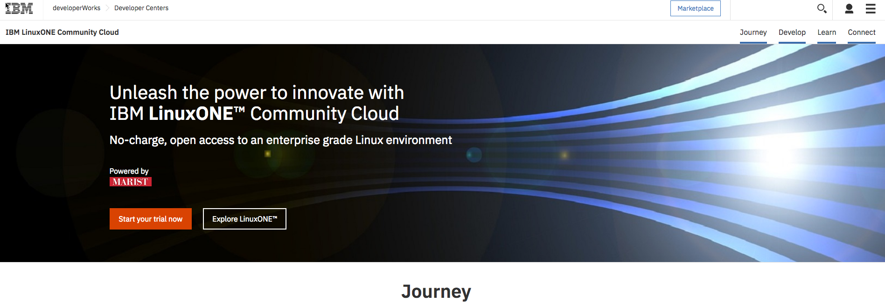
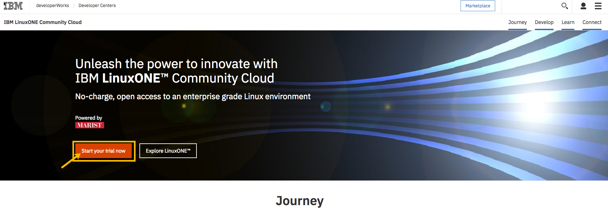
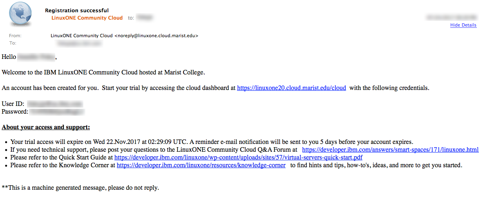
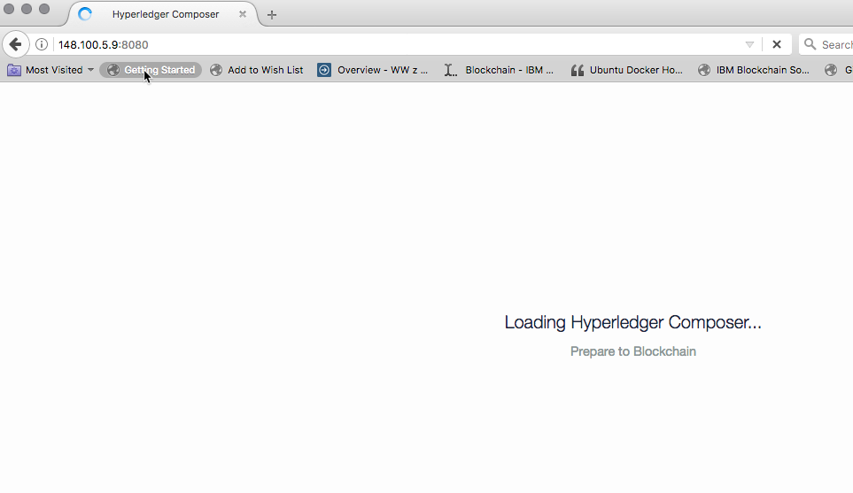

# Setup hackathon environment

This document will guide you through setting up a SLES 12 SP2 guest running Hyperledger Fabric and Hyperledger Composer. To do this, you will request access to the LinuxONE Community Cloud, establish a SLES guest, run a setup script and verify the installation.


It is broken down to the following steps:

1. [Request access to LinuxONE Community Cloud\.](#request-access-to-linuxone-community-cloud)
2. [Create your LinuxONE guest](#create-your-linuxone-guest)
3. [Setup your Linux guest for Hyperledger Fabric and Hyperledger Composer](#setup-your-linux-guest-for-hyperledger-fabric-and-hyperledger-composer)
4. [Verify the installation of Hyperledger Fabric and Hyperledger Composer](#verify-the-installation-of-hyperledger-fabric-and-hyperledger-composer)

#### Request access to LinuxONE Community Cloud.

1. In a browser, go to https://developer.ibm.com/linuxone/ .

   

2. **Click** *Start your trial now*.

   

3. **Complete** the required fields on the page and **select** *Request your trial*.

   

4. You will come to the following page. **Click** *Sign In*.

   

5. Check your email for a registration confirmation similar to the following shown. You'll need your User ID and Password from this email for the next step.

   

   #### Create your LinuxONE guest

6. Back in your browser, **enter** the *user ID* and *password* from your email. **Click** *Sign in*.

   - Note: Now is a good time to change your password to one you'll remember. This can be done after the initial sign in by selecting your username from the upper right corner of the web page and selecting account settings.

   

7. From the Home page of IBM LinuxONE Community Cloud, **select** *Manage Instances* on Virtual Servers under Infrastructure.

   

8. **Click** create.

   

9. Complete the following information:

   - **Select** *General Purpose VM* for the type.

   - **Note:** General purpose servers are deleted 120 days after registration.

   - Enter an instance name — `DJBlockchain`

   - **Select** *SLES12 SP3* for the image.

     

10. **Scroll down**. Under *Select a SSH Key Pair* **click** *create*.

  

11. In the pop-up dialog, **enter** the key name, `DJBlockchain` and **select** *Create a new key pair*.


12. Depending on your computer, you may receive a prompt asking you if you would like to save the new key pair. If so, choose to **Save File**.
   

13. In the *Select a SSH Key Pair* box, **select** your newly create key pair, *DJBlockchain*.

    

14. Review the Current Selection information for accuracy and **click** *create* at the bottom of the screen to create your SLES 12 LinuxONE guest.

    

15. ​Watch the status of your newly create guest go through the following phases of start up:  networking ➡️ spawning ➡️ Active. When your guest shows active, it is ready for use.

    - *Note* — Write down the IP address of your guest. You'll need that for the next steps.

    

16. From a terminal on your computer, navigate to the directory where you saved the SSH Key Pair, *DJBlockchain*. An example location is shown below.

   * **Note:** If you're running Windows then you will need to [install PuTTY](https://www.chiark.greenend.org.uk/~sgtatham/putty/latest.html). You will use PuTTY anywhere a terminal is used.

   

17. Modify the permissions of your private key by entering `chmod 600 DJBlockchain.pem`.
   

18. From the location where your *DJBlockchain.pem* SSH key pair is, enter the command `ssh -i DJBlockchain.pem linux1@xxx.xxx.x.x` where the x's correspond to your Linux guest IP.

19. **Type** `yes` to the continue connecting prompt and **hit** the *enter* key.

    

20. You are now connected into your IBM LinuxONE Community Cloud Guest!

    

    #### Setup your Linux guest for Hyperledger Fabric and Hyperledger Composer

21. Now it is time to setup your guest! Run the following command, to move the setup script from the Github Repository to your Linux guest.

    `wget https://raw.githubusercontent.com/IBM/HyperledgerFabric-on-LinuxOne/master/Linux1BlockchainScript.sh`

    

22. Enter `ls` to confirm the file is in your directory. 

    

23. To make the file executable, run `chmod u+x Linux1BlockchainScript.sh` and then `ls` to make sure that it is showing as an executable file.

    

24. You're ready to run the setup script! Run the script using the following command, `./Linux1BlockchainScript.sh`. Be patient. It takes awhile!
   

25. The first time you run the script, it will set some permissions and environment variables that require you to exit and log in again. 
    - Exit the session by **typing** `exit`. 
    - **Log in** again —  `ssh -i DJBlockchain.pem linux1@xxx.xxx.x.x` where the x's correspond to your Linux guest IP.
    - **Run** the script again — `./Linux1BlockchainScript.sh`
```
      linux1@djblockchain:~> ./Linux1BlockchainScript.sh 
      ID linux1 was not a member of the docker group. This has been corrected.
      PATH was missing '/data/npm/bin'. This has been corrected.
      Some changes have been made that require you to log out and log back in.
      Please do this now and then re-run this script.
```

25. It's completed when the command line returns. It will look similar to the following image.
   

26. For some of the changes made by the script to take effect, exit the ssh session by typing `exit`.
   

27. Log back in to your guest. `ssh -i DJBlockchain.pem linux1@xxx.xxx.x.x`where x is the values for your guest's IP address. (Refer to step 15 if you need help finding it.)
   

#### Verify the installation of Hyperledger Fabric and Hyperledger Composer

28. To see if your blockchain network is up and running, use the command `docker ps -a`. You should see 4 containers with image names like the ones shown below.
   

29. Verify that the composer command line interface and other tools were installed by entering `composer -v`.
   

30. Verify Composer Playground is running by looking for its process using the command, `ps -ef|grep playground`. 
   

31. Open a browser and enter `xxx.xxx.x.x:8080` into the address bar where the x's correspond to your Linux guest's IP address. 
    - **Note:** It is recommended to use Chrome as your browser for Hyperledger Composer Playground. It is also recommended that you open the Playground in a Incognito Window. This allows you to quickly clear cache and history if you start noticing odd behaviors.
    - **Note:** If you use Firefox, you cannot use it in Private mode. 
    - You should see the following:
      
      

32. Congratulations! Your environment is setup for the hackathon!
